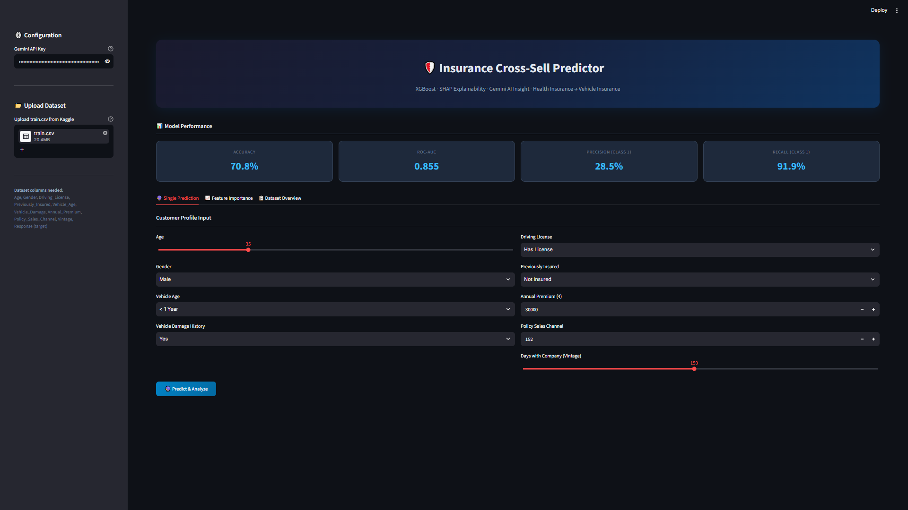
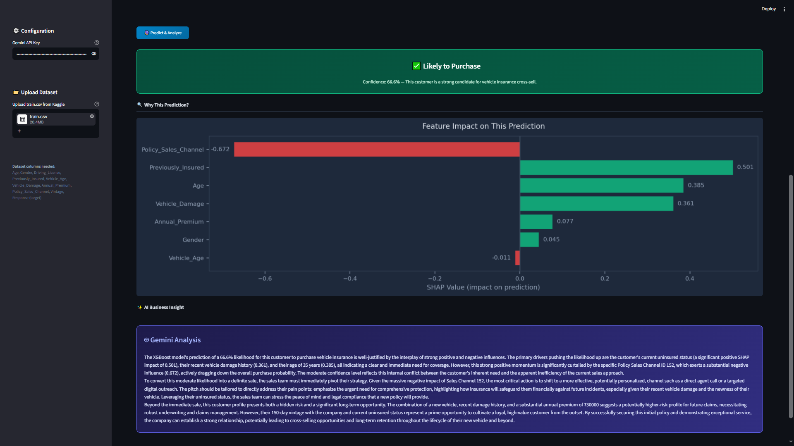
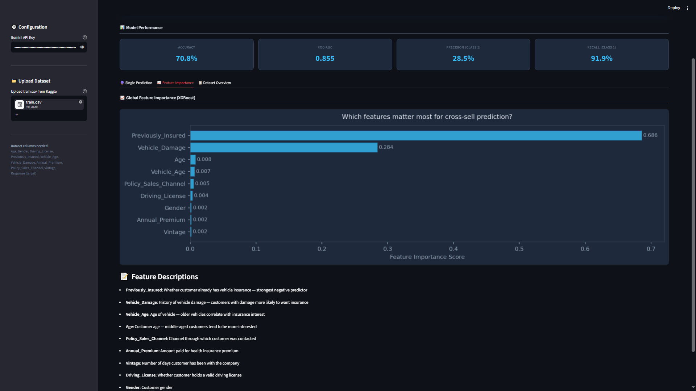
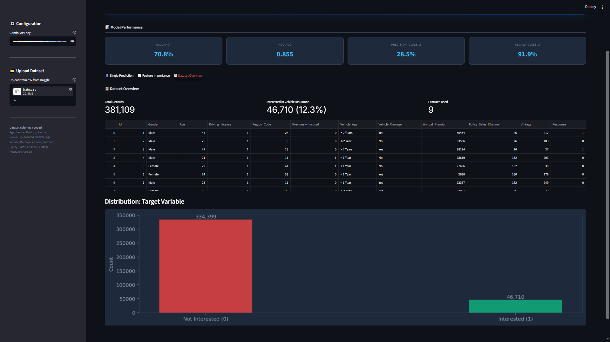

# 🛡️ Insurance Cross-Sell Prediction App

An upgraded ML pipeline for predicting whether health insurance customers will purchase vehicle insurance — built with **XGBoost**, **SHAP explainability**, and **Gemini AI insights**.

## 🚀 Features

| Feature | Description |
|---|---|
| **XGBoost Model** | Gradient boosting with class imbalance handling, optimized for AUC-ROC |
| **SHAP Explainability** | Understand *why* the model predicts each customer's behavior |
| **Gemini AI Insight** | Natural language business recommendations via Google Gemini API |
| **Interactive UI** | Clean Streamlit interface with customer profile input form |
| **Model Metrics** | Accuracy, ROC-AUC, Precision, Recall displayed in real-time |

## 📸 App Screenshots

### Dashboard & Input


### Prediction Result & AI Insight  


### Feature Importance


### Dataset Overview


## 📊 Dataset

Download from Kaggle: [Health Insurance Cross Sell Prediction](https://www.kaggle.com/datasets/anmolkumar/health-insurance-cross-sell-prediction)

Upload `train.csv` directly in the app sidebar.

## 🛠️ Tech Stack

- **Python** · **Streamlit** · **XGBoost** · **SHAP**
- **Scikit-learn** · **Pandas** · **NumPy** · **Matplotlib**
- **Google Gemini API** (REST)

## ⚙️ Installation & Run

```bash
# Clone this repo
git clone https://github.com/rizkiamandaa/Insurance-Cross-Sell-Predictor
cd Insurance-CrossSell-Predictor

# Install dependencies
pip install -r requirements.txt

# Run the app
streamlit run app.py
```

## 🔑 Gemini API Key

Get your free API key at [aistudio.google.com](https://aistudio.google.com) and enter it in the sidebar.

## 📈 Model Performance

| Metric | Score |
|---|---|
| Accuracy | ~70.8% |
| ROC-AUC | ~0.85 |

*Results may vary slightly depending on train/test split.*

---

Built by **Rizki Amanda Putri** · [GitHub](https://github.com/rizkiamandaa) · [LinkedIn](https://linkedin.com/in/rizkiamandaa)
